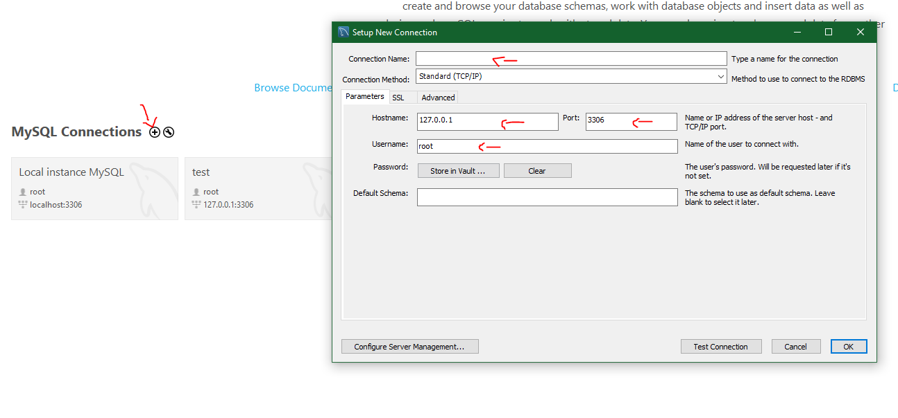
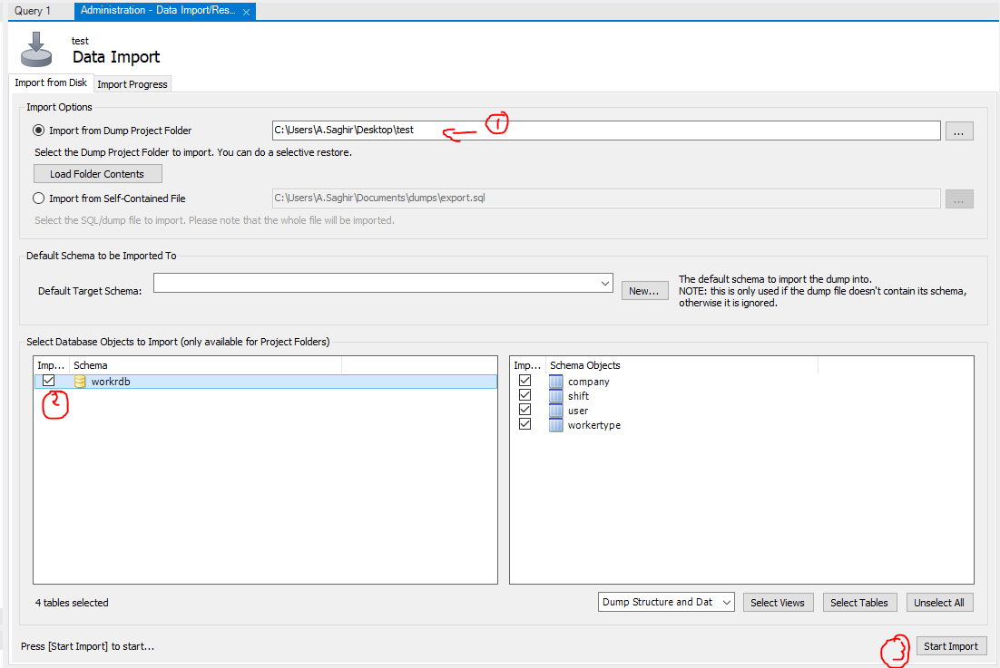
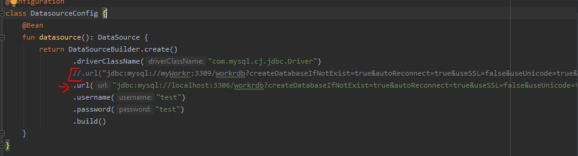
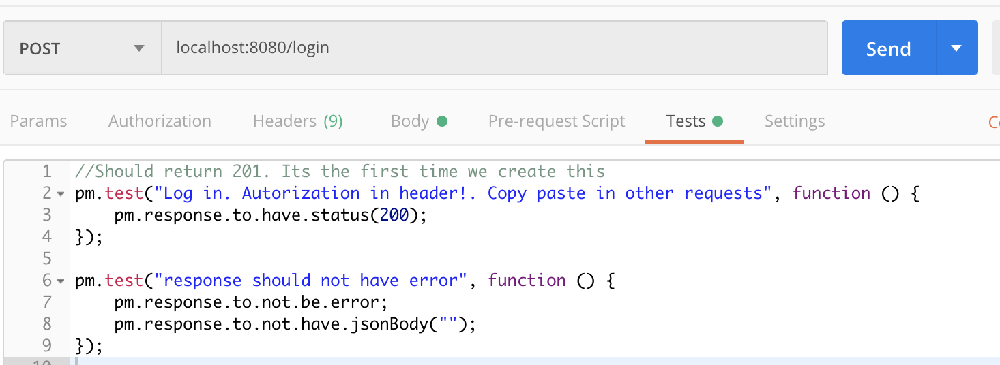
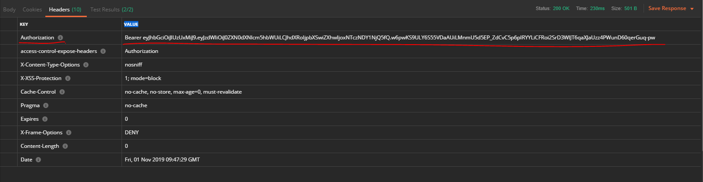
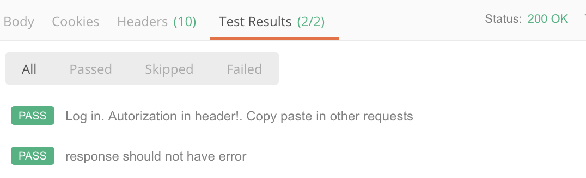
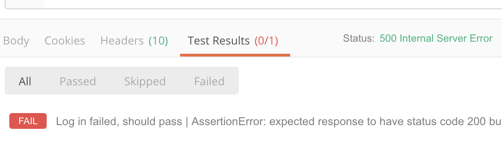
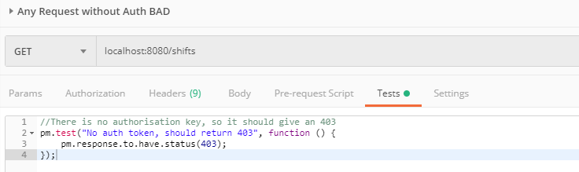
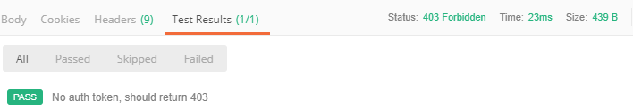
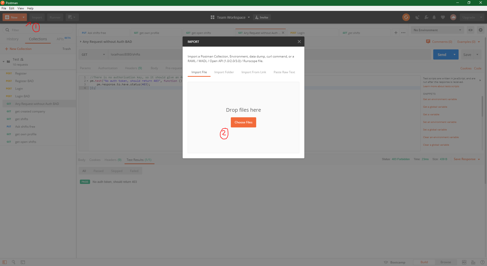

#
# 1 Installatie

De backend is te draaien wanneer de meegeleverde Workr backend map is uitgepakt. Daarna zal via de terminal of powershell naar de Workr map moeten worden genavigeerd en zal de volgende commando moeten worden uitgevoerd: _docker-compose up_

De database en backend zullen beide opgestart worden.

Mocht dit niet het geval zijn, dan is de database apart te importeren. Hiervoor heb je mySQL workbench nodig en maak je een nieuwe instantie aan in de workbench.

 

Er moet een connectie naam worden opgegeven, een ip, poort en username. We raden om alles te laten staan zoals het is. Mocht je dit aanpassen zullen de gegevens in de backend ook aangepast moeten worden.

Het bijgeleverde WorkrSQLDB map kan daarna geïmporteerd worden via &quot;Server -\&gt; Data Import&quot; in de werkbalk.

 

Selecteer het zojuist gedownloade WorkrSQLDB map (1), daarna selecteer je het Workrdb  schema (2) en klik je op start import (3).

Omdat de backend een connectie maakt met docker, zal de url aangepast moeten worden naar localhost. De eerste url zal gecommentarieerd moeten worden, en de tweede zal aangezet moeten worden. Eventueel zal je de gebruikersnaam en wachtwoord moeten aanpassen.

Hierna kan de backend gestart worden door op het groene knop, rechtsboven te klikken.

## 2 Testen

Het testen is gedaan door middel van Postman. Er is een bestand meegeleverd waar alle testen in staan met de juiste API calls. Deze zijn te importeren in Postman waarna ze te gebruiken zijn. Bepaalde API endpoints zijn getest, maar buiten gelaten in Postman en dit document omdat deze normaal niet uitgevoerd kunnen worden door gebruikers. Deze tests worden normaal gesproken gedaan door systeembeheerders. Denk hierbij aan het maken van een admin account.  De backend is ook uitgebreidt getest door het front end en hybride app te testen. Deze tests zijn in blackboard terug te vinden.

Hieronder is een voorbeeld toegevoegd dat betrekking heeft tot het inloggen. 

In de eerste test kan gelezen worden dat er gekeken wordt of het inloggen een 200 OK teruggeeft. De authenticatie code wordt dan in de header verstuurd dat in alle andere tests moet worden geplaatst.

In in de tweede test wordt er gekeken of er geen error is en of de body geen json bevat. De token wordt immers als headers meegestuurd. Als de dit het geval is zal de test slagen en dit wordt als volgt getoond in de resultaten:

Mocht een test niet goed gaan zal dit ook aangegeven worden door een fail. Dit ziet er als volgt uit:

Er wordt een statuscode 200 verwacht maar krijgt een 500 (internal server error). 

Een ander voorbeeld bij het testen is dat er bijna elke call naar de backend een Authorization token nodig is in de header. Mocht dit niet het geval zijn wordt er een 401/403 statuscode terug gestuurd en weet de app dat de gebruiker geen toestemming heeft tot een bepaalde API call. Neem als voorbeeld het ophalen van alle shifts, als er geen authenticatie token wordt meegestuurd dan ziet het als volgt uit:

Er wordt een statuscode verwacht die gelijk is aan 200, echter wordt er geen Authorization key value meegestuurd.

Zoals de test al beschrijft, hoort er een 403 statuscode terug te komen en wat inderdaan het geval is.

## Importeren

Om Postman tests te importeren zal het bestand “Test.postman_collection.json” in Postman moeten worden geïmporteerd. Dit kan geïmporteerd worden door Postman op te starten en op de knop “Import”, links bovenin te klikken. Er zal een scherm worden geopend waar het bestand ingesleept kan worden.

Na het importeren zullen de tests in het tabblad “Collection” komen te staan, deze kunnen dan uitgevoerd worden door het te openen en het te verzenden.
